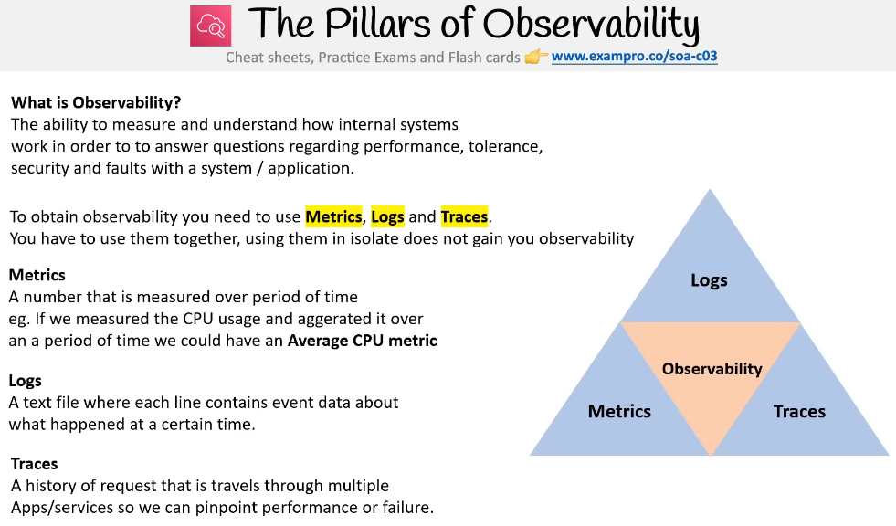
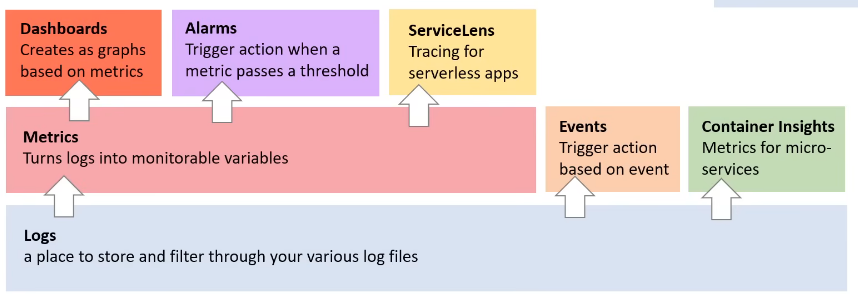
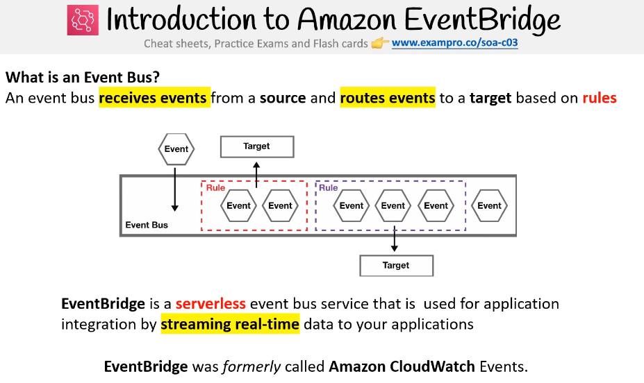

# Observability
<div style="text-align: center;"></div>  

# CloudWatch
- Collection of monitoring tools:  ***Logs, Metrics, Events, Alarms, Dashboards***
<div style="text-align: center;"></div>


## **Metrics**
- It's the watch of a values/variables over points of time for specific resource. ex: CPUUtilization
- `Metric Intervals`: How often metrics will be sent to you
- `Metric Resolution`: How often metrics will be collected from target
- ***Ex:*** Basic Monitoring(5m) with High Resolution(1s)
    - collect metrics every second but send all collected every 5m
- not all ec2 metrics are tracked without an agent (need to install cloudwatch agent on Ec2)
- Each metric has a namespace that fall into.


## **Alarm**:
- It's used to trigger an action based on  
- alarm state trigger 
    - INSUFFICIENT **->** no enough data is available. 
    - OK **->** metric is within the defined threshold.
    - IN ALARM **->** metric is outside of the defined threshold.
- threshold 
    - threshold types **->** `Static & Anomaly`
    - Condition **->** (Greater, Greater/Equal, Lower/Equal, Lower)
- Action (Notifications, ASG, EC2 Actions, Lambda)

## **Logs**
- The actual Text logs produced by application (Access Logs, App Logs, Execution Logs)
- Mainly used for Centralized Logging: Logs, Logs Groups, Log Streams
    - Log Group as a Folder 
    - Log Stream as a File 
    - Log Events (logs) as Text lines
- **Turn logs → metrics** `==` **Metrics Filter**
    - A Metric Filter watches your logs and turns matching lines into numbers.
    - How many times did this text appear in my logs?
    - use it with alarms 

- Collect Logs Automatically -> ✅ CloudWatch Agent 
- Custom application sends logs directly -> ✅PutLogEvents API / SDK (boto3)
- logs has to be in order then we should use:
    - **DescribeLogStreams API**: to know the last log sequence tokens and the existence of the log stream
    - **PutLogEvents API**: Send logs api

| Code Part            | AWS Concept       |
| -------------------- | ----------------- |
| describe_log_streams | Read stream state |
| uploadSequenceToken  | Enforce ordering  |
| put_log_events       | Send logs         |
| logGroupName         | Container         |
| logStreamName        | Source            |
| logEvents            | Actual logs       |

---


<div style="text-align: center;"></div>

## **EventsBridge**:
- Event
- Producer
- Event Bus (Place that contain events)
- Rules (determine what events to deliver)
- Targets (the target consume events)
- common use case: (Trigger DB Backup everyday)

# CLoudTrail
- Monitor API calls and Actions
- we use it to identify:
    - who User, UserAgent
    - Where Source IP Address
    - When EventTime
    - What Region, resource
## Trail
- It tracks:
    - Management Events (Default): login, configure IAM & etc.
    - Data Events: track specific events for aws service like S3 & Lambda
    - ***`Enable log file validation (detect tampering)`***
- And store this events in S3 Buckets / send them to cloudwatch Logs Group

```txt
CloudTrail = the service
Event = “Someone did something” (e.g., DeleteBucket)
Trail = the rule that says:
“Record these events and store them here”
```


# AWS Config
- AWS Config is a Compliance-as-code tool to manage change in AWS per region 
- Config stores snapshots in S3
- Change Management 
    - Monitor configuration changes
    - Track who made changes (via CloudTrail integration)
    - Evaluate compliance
    - Remediate non-compliant resources


- CAC Compliance-as-code.
    - Automate the monitoring & enforce and remediating changes according to compliance 

- ⚠️ Important: `AWS Config does NOT prevent changes by default — it detects and evaluates them.`

## Resources invertor
- show you all resource created in a region

## Recourse timeline
- It shows a timeline of changes to a resource:
    - Configuration Timeline → How the resource changed over time
    - Compliance Timeline → When it was compliant/non-compliant
- This is the full recorded state of the resource at that moment.
    - It shows what happen, what changes, before & after
    - `It doesn't contain API Operation or who did the change` -> go to cloudtrail for this.
    
## Rules 
- rules are set to check of a desired configuration is met or not 
- Types:
    - AWS Managed Rules (predefined)
    - AWS custom rules (you define logic)
- Rule Triggers:
    - Configuration changes
    - Periodic 

## Automatic/Manual Triggered remediation
- The Action of reversion or stopping or correcting something
- Automatic remediation usually uses:
    - AWS Systems Manager Automation documents

## Conformance Pack
- A collection of rules and remediation actions that can be deployed as single entity

## Aggregation  
- Aggregate AWS Config data from:
    - Multiple accounts
    - Multiple regions
- Used in multi-account environments


# AWS Security Hub
- It's a Security posture management Tool
- It generate a security score to determine your security posture
- It depends on AWS Config to be able to work
- Security Hub depends on AWS Config evaluations.